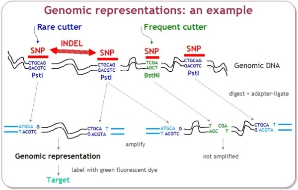
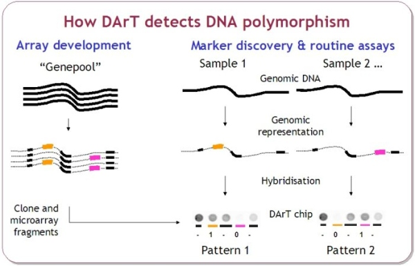
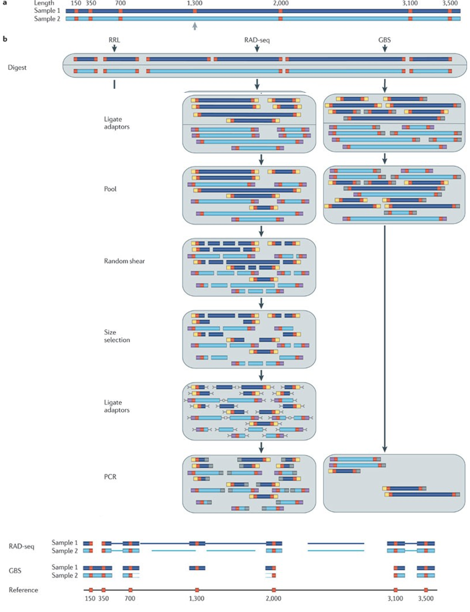
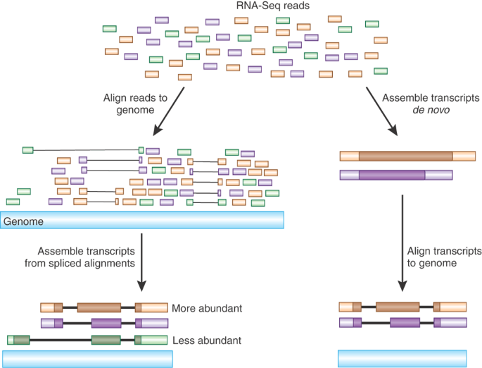

## Introduction

###  Genomic Complexity Reduction

Massive sequencing technology increased drastically, and, at the same time, the cost of sequencing decreased in the past twenty years, this brought an opportunity to develop different technology. The principal technique is the whole genome sequencing, nevertheless this is still expensive. Direct sequencing of reduced genome representations have emerged and it is an option for genotyping at reasonable cost. Reduced genome representation has been generated using restriction enzyme digestion, adaptor ligation, and selective PCR amplification, followed by the sequencing.

 

### DARTseq

DArT markers is the genomic representation generated by the amplification of a set of restriction fragment and polymorphism at the restriction site (SNP and Indels). Those markers reveal absence/presence of a particular fragment of the genome. In the DarT markers technique, the presence/absence was detected by hybridization of microarrays containing individualized clones representing the genomic background of the species. DArT was developed in early 2000 (ref), and it does not need information of DNA sequence. Nowadays it is used more frequently and combined with the high-throughput genotyping method technology. DArT-Seq™ technology is developed by Diversity Arrays Technology Pty Ltd (Canberra, Australia https://www.diversityarrays.com/). DArT-Seq™ technology is based on a complexity reduction method to enrich genomic representations with single copy sequences. This reduced complexity is revealed by next-generation sequencing using HiSeq2000 (Illumina, USA). DArT-Seq detects both SNPs and presence–absence sequence variants and targeted low-copy DNA areas. The first step in the DArT-seq procedure involves the reduction in the number of fragments present in the genomic representation. This is called complexity reduction. Most DArTseq applications used a combination of restriction enzymes, and then adapters to reveal restriction fragments by amplification of those by PCR. Illumine sequencing technology is used to sequence the fragment. Therefore, DNA samples were processed in digestion/ligation reactions as described by Kilian et al. (2012). Most of the time a combination of enzymes is used depending on the genome complexity. NGS of these ‘representations’ reveals the sequence (approx. 70 bp) of an informative DNA fragment and each individual's state compared with all others, namely (i) homozygosity with reference allele, (ii) homozygosity with alternate allele, or (iii) heterozygosity, comprising both a reference and an alternate SNP allele.

  

  

### GBSseq

GBS, **Genotyping By Sequencing**, belongs to the complexity reduction of family markers. It allows the discovery of SNPs and Indels without prior knowledge of the species’ genome sequence. Thus, reducing the sequencing cost, GBS is a good compromise to generate massive amount of data for a large and complex genome species. Those markers can be used in GWAS, GS, gd-study, linkage mapping, evolutionary studies, conservation and ecological studies. It can also combine discovery and genotyping in the absence of reference genome. Library’s construction GBS mainly focuses on genome complexity reduction with enzymes. GBS is simpler, quicker, extremely specific, highly reproducible, and may reach important genomes’ regions that are inaccessible. To obtain higher efficiency in GBS, restriction enzymes are appropriately selected in order to avoid repetitive regions of genomes and lower copy regions.

### RADseq

RAD **Restriction site associated DNA** markers, combine the use of restriction enzymes to cut DNA into fragments, and the use of molecular identifiers (MID), to associate sequences reads to a sample. The DNA of each sample is cut with a restriction enzyme couple and produce a sticky-ended fragment. In order to sequence with the generated fragment, they are ligated to adapters which bind to an Illumina flow cell. Samples can be pooled in order to find the polymorphism inside a population. RAD markers are randomly distributed across the target genome. It reduces the genome complexity by subsampling only at specific sites defined by restriction enzymes. RADseq can identify, verify and score markers simultaneously. 

### Markers Schema

  

 Ref Image :

### RNAseq

  RNAseq (RNA sequencing) is the technological approach to sequence the transcriptome with deep-sequencing technologies (454, SOLID, Illumina, Nanopore….). It describes the quantity and sequence of gene in a given tissue of the organism analyzed. It represents the gene expression pattern encoded within the RNA. The cell contains different types of RNAs, massager RNA (mRNA), ribosomal RNA (rRNA) and transfer RNA (tRNA). The transcriptome is an essential key to connect the information of our genome to the functional protein expression. RNAseq tells us which genes are involved in a cell, the expression level and the time when they are active. The most popular application is transcriptional profiling, SNP identification, RNA editing and differential gene expression analysis. RNAseq allows to discover gene function, alternative splicing events which produce different transcripts from one single gene sequence. It can also identify post-transcriptional modifications that occur during mRNA processing as polyadenylation and 5’ capping.
  In order to obtain RNAseq data, multiple steps are necessary, first the tissue must be chosen according to the question. Then the RNA is extracted and a cDNA (complementary DNA) is made, corresponding to the coding region. Then the library made is sequenced with the adequate technology. This produces short sequences for Illumine but the size of reads can be longer with the new technology and the single cell. Those reads are aligned to a reference genome and produce an RNA sequence map that represents the transcriptome. 

  

Ref image : 
