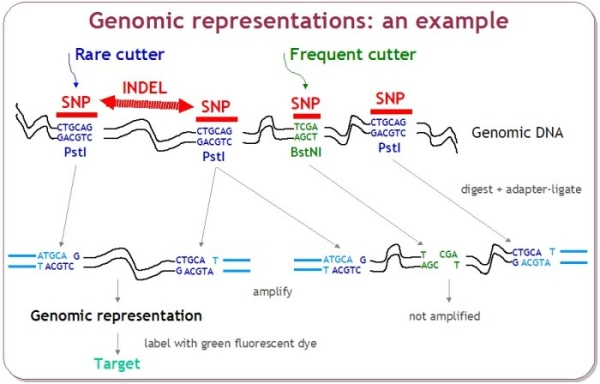
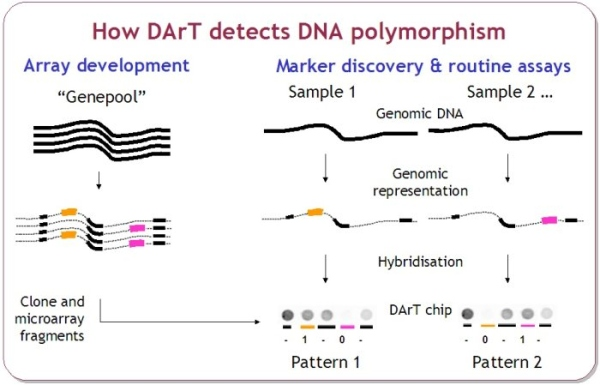
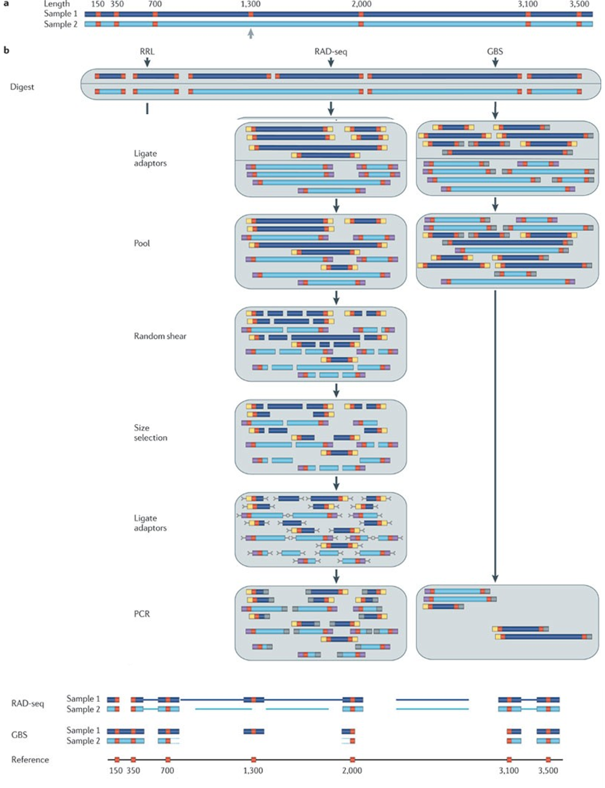
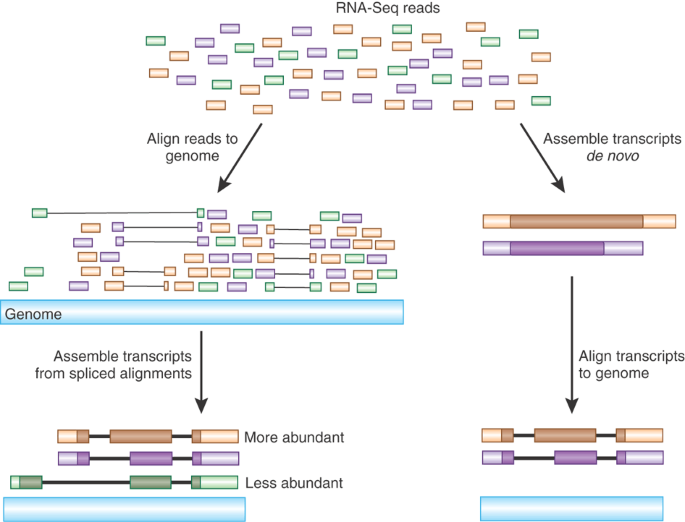
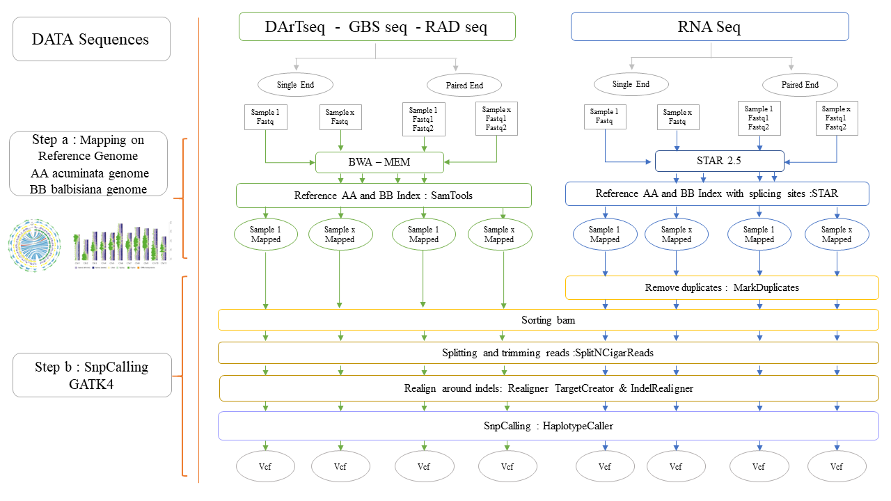
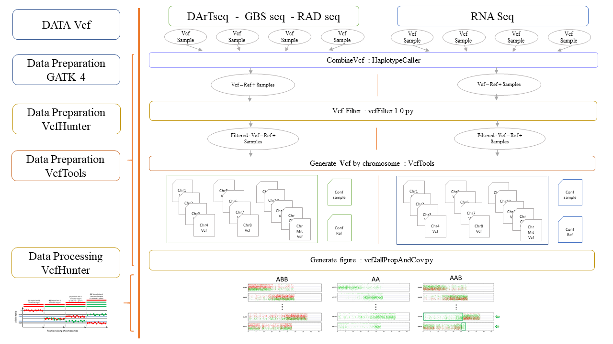
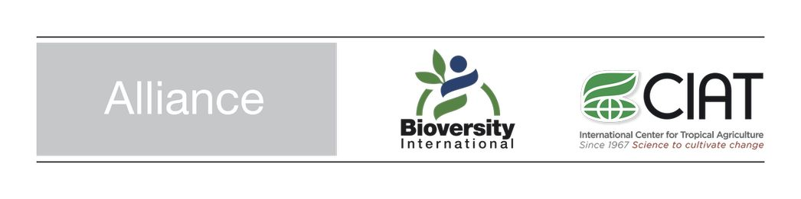

# *Musa_NGS_Suite*

Purpose of Musa_NGS_Suite
--------------------------

<div align="justify">
Musa NGS Suite, is a collection of scripts that are used in different projects to analyse banana genomes using NGS datasets. 
This suite comprises two main parts. The first part starts from the cleaning of reads to SNP calling. This procedure applied in Elan et al, crop science 2020.
The second part adds additional steps to study the structure of chromosomes that we applied for the detection of large insertion and deletions to check the genetic integrity of banana samples maintained in collection
</div>


Dependencies
------------
The tools are developed in Perl, bash, Python3, Java and work on the Linux system and require:

| Tools  | Website | Version |
| ------ | ------- | ------- |
| Bamtools      | https://github.com/pezmaster31/bamtools                         | bamtools/2.4.0 |
| BWA           | http://bio-bwa.sourceforge.net                                  | bwa/0.7.12 |
| Cutadapt      | https://cutadapt.readthedocs.io/en/stable/                      | cutadapt/2.10  |
| FastQC        | https://www.bioinformatics.babraham.ac.uk/projects/fastqc/      | FastQC/0.11.7 |
| GATK V4       | https://software.broadinstitute.org/gatk/                       | GenomeAnalysisTK/4.1.9.0 |
| GATK V3       | https://software.broadinstitute.org/gatk/                       | GenomeAnalysisTK/3.7-0   |
| Picard Tools  | https://broadinstitute.github.io/picard/                        | picard-tools/2.7.0   |
| sambamba      | https://lomereiter.github.io/sambamba/                          | sambamba/0.6.6 |
| Samtools      | https://github.com/samtools/samtools                            | samtools/1.2  |
| STAR          | https://github.com/alexdobin/STAR                               | STAR/2.5.0b |
| VCFHunter     | https://github.com/SouthGreenPlatform/VcfHunter                 |  |
| Vcftools      | https://vcftools.github.io/index.html                           | vcftools/0.1.14  |

For the installation of the differents software, in is under construction.
Be carefull, those pipeline are part of a cluster architecture, so change the path of the software inside the scipt, this is a futur improvement of the pipeline. 


Sun Grid Engine (SGE) and SLURM job scheduler concepts are quite similar.
All the script are developped to use them in SGE systeme HPC. 
In order to adapt those script to SLURM , one script is added, but not finish in the SLURM folder.


<details>
<summary>Table of content</summary>

## Table of contents

- [**How to cite**](#How-to-cite)
- [**Introduction**](#Introduction)
  - Genomic Complexity Reduction
  - DARTseq
  - GBSseq
  - RADseq
  - RnaSeq
  - Markers Schema
- [**Workflow - Quality control, cleaning, mapping, SNPCalling**](#workflow---molecular-karyotype-analysis)
  - Input raw data
  - Read Quality check
  - **Step a : Mapping reads on the reference**
  - DNA Data
  - RNA Data
  - **Step b : Variant discovery**
- [**Workflow - Molecular karyotype analysis**](#workflow---molecular-karyotype-analysis)
  - Merge datasets
  - Filter SNP dataset
  - Split VCF by chromosome
  - Generate molecular karyotype
- [**Authors and acknowledgments**](#authors-and-acknowledgment) 
- [**Contact**](#contact) 

</details>

How to cite
-----------
<div align="justify">
Filling the gaps in gene banks: Collecting, characterizing and phenotyping wild banana relatives of Papua new guinea (2020) David Eyland, Catherine Breton, Julie Sardos, Simon Kallow, Bart Panis, Rony Swennen, Janet Paofa, François Tardieu, Claude Welcker Steven B. Janssens, Sebastien C. Carpentier. *Crop Science* https://doi.org/10.1002/csc2.20320  
</div>
  
&nbsp;

If you use the second workflow.
<div align="justify">
Breton Catherine, Cenci Alberto, Sardos Julie, Chase Rachel, Ruas Max, Rouard Mathieu & Roux Nicolas (2022). A Protocol for Detection of Large Chromosome Variations in Banana Using Next Generation Sequencing. In: Jankowicz-Cieslak, J., Ingelbrecht, I.L. (eds) Efficient Screening Techniques to Identify Mutants with TR4 Resistance in Banana. Springer, Berlin, Heidelberg. https://doi.org/10.1007/978-3-662-64915-2_9
</div>
&nbsp;

Study using the tools : 

<div align="justify">
Sardos J, Breton C, Perrier X, Van den Houwe I, Carpentier S, Paofa J, Rouard M and Roux N (2022) Hybridization, missing wild ancestors and the domestication of cultivated diploid bananas. Front. Plant Sci. 13:969220. https://doi.org/10.3389/fpls.2022.969220
</div>
&nbsp;

## Introduction


###  Genomic Complexity Reduction

<div align="justify">
Massive sequencing technology increased drastically, and, at the same time, the cost of sequencing decreased in the past twenty years, this brought an opportunity to develop different technology. The principal technique is the whole genome sequencing, nevertheless this is still expensive. Direct sequencing of reduced genome representations have emerged and it is an option for genotyping at reasonable cost. Reduced genome representation has been generated using restriction enzyme digestion, adaptor ligation, and selective PCR amplification, followed by the sequencing.
</div>

 

### DARTseq

<div align="justify">
DArT markers is the genomic representation generated by the amplification of a set of restriction fragment and polymorphism at the restriction site (SNP and Indels). Those markers reveal absence/presence of a particular fragment of the genome. In the DarT markers technique, the presence/absence was detected by hybridization of microarrays containing individualized clones representing the genomic background of the species. DArT was developed in early 2000 (ref), and it does not need information of DNA sequence. Nowadays it is used more frequently and combined with the high-throughput genotyping method technology. DArT-Seq™ technology is developed by Diversity Arrays Technology Pty Ltd (Canberra, Australia https://www.diversityarrays.com/). DArT-Seq™ technology is based on a complexity reduction method to enrich genomic representations with single copy sequences. This reduced complexity is revealed by next-generation sequencing using HiSeq2000 (Illumina, USA). DArT-Seq detects both SNPs and presence–absence sequence variants and targeted low-copy DNA areas. The first step in the DArT-seq procedure involves the reduction in the number of fragments present in the genomic representation. This is called complexity reduction. Most DArTseq applications used a combination of restriction enzymes, and then adapters to reveal restriction fragments by amplification of those by PCR. Illumine sequencing technology is used to sequence the fragment. Therefore, DNA samples were processed in digestion/ligation reactions as described by Kilian et al. (2012). Most of the time a combination of enzymes is used depending on the genome complexity. NGS of these ‘representations’ reveals the sequence (approx. 70 bp) of an informative DNA fragment and each individual's state compared with all others, namely (i) homozygosity with reference allele, (ii) homozygosity with alternate allele, or (iii) heterozygosity, comprising both a reference and an alternate SNP allele.
</div>


<p align="center">
  
</p>

<p align="center">
  
</p>

### GBSseq

<div align="justify">
GBS, *Genotyping By Sequencing*, belongs to the complexity reduction of family markers. It allows the discovery of SNPs and Indels without prior knowledge of the species’ genome sequence. Thus, reducing the sequencing cost, GBS is a good compromise to generate massive amount of data for a large and complex genome species. Those markers can be used in GWAS, GS, gd-study, linkage mapping, evolutionary studies, conservation and ecological studies. It can also combine discovery and genotyping in the absence of reference genome. Library’s construction GBS mainly focuses on genome complexity reduction with enzymes. GBS is simpler, quicker, extremely specific, highly reproducible, and may reach important genomes’ regions that are inaccessible. To obtain higher efficiency in GBS, restriction enzymes are appropriately selected in order to avoid repetitive regions of genomes and lower copy regions.
</div>

### RADseq

<div align="justify">
RAD *Restriction site associated DNA* markers, combine the use of restriction enzymes to cut DNA into fragments, and the use of molecular identifiers (MID), to associate sequences reads to a sample. The DNA of each sample is cut with a restriction enzyme couple and produce a sticky-ended fragment. In order to sequence with the generated fragment, they are ligated to adapters which bind to an Illumina flow cell. Samples can be pooled in order to find the polymorphism inside a population. RAD markers are randomly distributed across the target genome. It reduces the genome complexity by subsampling only at specific sites defined by restriction enzymes. RADseq can identify, verify and score markers simultaneously. 
</div>


### Markers Schema


<p align="center">
  
</p>
 Ref Image :


### RNAseq

<div align="justify">
  RNAseq (RNA sequencing) is the technological approach to sequence the transcriptome with deep-sequencing technologies (454, SOLID, Illumina, Nanopore….). It describes the quantity and sequence of gene in a given tissue of the organism analyzed. It represents the gene expression pattern encoded within the RNA. The cell contains different types of RNAs, massager RNA (mRNA), ribosomal RNA (rRNA) and transfer RNA (tRNA). The transcriptome is an essential key to connect the information of our genome to the functional protein expression. RNAseq tells us which genes are involved in a cell, the expression level and the time when they are active. The most popular application is transcriptional profiling, SNP identification, RNA editing and differential gene expression analysis. RNAseq allows to discover gene function, alternative splicing events which produce different transcripts from one single gene sequence. It can also identify post-transcriptional modifications that occur during mRNA processing as polyadenylation and 5’ capping.
  In order to obtain RNAseq data, multiple steps are necessary, first the tissue must be chosen according to the question. Then the RNA is extracted and a cDNA (complementary DNA) is made, corresponding to the coding region. Then the library made is sequenced with the adequate technology. This produces short sequences for Illumine but the size of reads can be longer with the new technology and the single cell. Those reads are aligned to a reference genome and produce an RNA sequence map that represents the transcriptome. 
</div>


<p align="center">
  
</p>

Ref image : 

## Workflow - Quality control, cleaning, mapping, SNPCalling

<div align="justify">
The preprocessing pipeline presented in Figure 1 shows the different steps that are compatible with four different sequencing technologies as listed in the previous section. The pipeline has to be done sample per sample according to the best practice of the software GATK used for the SNP calling part. 
</div>




Description
-----------

The package provided comprised 4 programs listed here:
The modèle of submission depends on Sun  Grid  Engine  supports. In order to paralelize the pipeline, a jobarray is used for the 4 scripts. 


- Script Dart GBS Rad seq
  - DarT_GBS_Rad_seq_paired_end_fastq_to_Vcf_gvcf_jobarray_Total_GATK4.pl
  - DarT_GBS_Rad_seq_single_end_fastq_to_Vcf_gvcf_jobarray_Total_GATK4.pl
  
 - Script RNA seq
   - RNA_seq_paired_end_fastq_to_Vcf_gvcf_jobarray_Total_GATK4.pl
   - RNA_seq_single_end_fastq_to_Vcf_gvcf_jobarray_Total_GATK4.pl 


```
Usage : perl <Script-Name> -r reference_fasta -x extension_file_to_treat -cu cultivar" 
```

```
Parameters : 
 
-r reference_fasta 
-x extension_file_to_treat 
-cu cultivar
```

Furtur developpmnent, in order to adapt the script job submission to Slurm (Simple Linux Utility for Resource Management) model, new script will be added to the package. 

 
### Input raw data

<div align="justify">
All those types of markers have the same type of raw data, fastq files, that is a reads sequence fasta associated to the quality coded according the sequencing company used. Two types of data are used in this pipeline, single end or paired end sequence. In single-end reading, the sequencer reads a fragment from only one end to the other, generating the sequence of base pairs. In paired-end reading it starts at one read, finishes this direction at the specified read length, and then starts another round of reading from the opposite end of the fragment.
</div>

### Read Quality check

- Quality reads: Control the quality of the raw Fastq file with FASTQC

Description: In order to verify the quality of data reads, FastQC allows to check the quality score of each base and the presence or absence of the adaptor used to build the library. Adaptor depends on the sequencing technology used.   https://www.bioinformatics.babraham.ac.uk/projects/fastqc/

- Trim low-quality base with Cutadapt
Description: According to the result of FastQC, Cutadapt [20] trims low quality ends and removes adapters (illumina). Website: http://cutadapt.readthedocs.io/en/stable/guide.html.

```
Fixed Parameters:
-b AGATCGGAAGAGC (universal sequence for Illumina). Sequence of an adapter that was ligated to the 5’ or 3’ end. The adapter itself is trimmed and anything that follows too if located at 3’ end.
-O 7: Minimum overlap length. If the overlap between the read and the adapter is shorter than LENGTH, the read is not modified. This reduces the no. of bases trimmed purely due to short random adapter matches.
-m 30: Discard trimmed reads that are shorter than 30.
--quality-base=64: Assume that quality values are encoded as ascii (quality + QUALITY_BASE). The default (33) is usually correct, except for reads produced by some versions of the Illumina pipeline, where this should be set to 64. (Default: 33)
-q 20,20: Trim low-quality bases from 5' and/or 3' ends of reads before adapter removal. If one value is given, only the 3' end is trimmed. If two comma-separated cutoffs are given, the 5' end is trimmed with the first cutoff, the 3' end with the second. The algorithm is the same as the one used by BWA (see documentation).
```

The tool generates a trimmed fastq file (*_cutadapt.fastq.gz) files for each accession.

- Check homogeneity of the paired fastq files

In the paired-end data generated, it is possible to verify if both reads are present in the two fastqc files. This step is optional because mapper software BWA or STAR do not accept if read 1 and 2 are not present. This is done with the perl script compare_fastq_paired_v5.pl.

## **Step a: Mapping reads on the reference**

**Description**: Align reads on a reference genome (e.g. Musa acuminata ‘DH Pahang’), with BWA [21] for DNA, and STAR [22] for RNA.

**DNA Data**: Map with BWA with default parameters with BWA-MEM

Different types of genomic data such as DArTSeq, GBS and RADseq can be used (Figure 1).

The tool generates a sam (*_.sam) files for each accession.

Website: http://bio-bwa.sourceforge.net/

**RNA Data**: Mapping with STAR in 2-pass mode

**Description**: In the 2-pass mapping job, STAR will map the reads twice. In the 1st pass, the novel junctions will be detected and inserted into the genome indices. In the 2nd pass, all reads will be re-mapped using annotated (from the GTF file) and novel (detected in the 1st pass) junctions. While this procedure doubles the run-time, it significantly increases sensitivity to novel splice junctions. In the absence of annotations, this option is strongly recommended.

Reference preparation : 


```
Parameter for  STAR Indexe Reference : 

The basic options to generate genome indices using STAR are as follows:

    --runThreadN: number of threads
    --runMode: genomeGenerate mode
    --genomeDir: /path/to/store/genome_indices
    --genomeFastaFiles: /path/to/FASTA_file
    --sjdbGTFfile: /path/to/GTF_file
    --sjdbOverhang: readlength -1


STAR 
--runMode genomeGenerate 
--runThreadN 1
--genomeDir Genome_Index_STAR 
--genomeFastaFiles Reference_assembly.fasta 
--sjdbGTFfile Reference.gff3
--sjdbGTFtagExonParentTranscript Parent 
--sjdbOverhang 100


$star_path/STAR
--genomeDir $genome_indexes_dir 
--readFilesIn $forward_without_ext.cutadapt.fastq $reverse_without_ext.cutadapt.fastq
--outSAMunmapped Within
--outFileNamePrefix $filenm_root
--outSAMmapqUnique 255 
--twopassMode Basic 
--quantMode GeneCounts"

```


The tool generates a folder for each accession, (names filled in column 3 "genome_name") filled in the configuration file, which contained the SAM files of aligned reads and a .final.out file of mapping statistics for each library. In addition, a (--prefix) folder containing a mapping statistics file (--prefix + mapping.tab) for all accession is generated.

Website: https://github.com/alexdobin/STAR

## **Step b** Variant discovery

<div align="justify">
This step is devided in two main steps, two "SnpCalling". First one with filter parameter stringeant allow to recalibrate the bam file. The second SnpCalling allow to avoid the false positive position.
</div>

-	Add read group and (accession name from the fq.gz filename) sort BAM with Picard Tools

**Description**: This step replaces the reads Groups which describe the reads mapped on the reference, the sequencing technology, samples names, and library number are added.

```
Fixed Parameters:
ID = Read Group identifier (e.g. FLOWCELL1.LANE1)
PU = Platform Unit (e.g. FLOWCELL1.LANE1.UNIT1)
SM = Sample (e.g. DAD)
PL = Platform technology used to produce the read (e.g. ILLUMINA)
LB = DNA library identifier (e.g. LIB-DAD-1)
```
Website: https://broadinstitute.github.io/picard/

The tool generates a bam (*_rmdup.bam) files for each accession with the RG (Read Group) modified.

- Mark duplicate reads and index BAM with MarkDuplicates from PicardTools

**Description**: PCR duplicate removal, where PCR duplicates arise from multiple PCR products from the same template molecule binding on the flow cell. These are removed because they can lead to false positive variant calls. Sort the BAM file and mark the duplicated reads.
This step is done on RNAseq, not on DarTseq, GBS or RADseq.
Website: https://broadinstitute.github.io/picard/

The tool generate a bam (*_rmdup.bam) files for each accession with duplicated reads removed.
In addition, a file named (--prefix + rmdup*stat.tab) file containing duplicate statistics for each accession was generated in the (--prefix) folder.

- Index BAM with Samtools

**Description**: This step reorder the bam file according to the genome index position.
Website: http://samtools.sourceforge.net/
The tool generates a reordered (*_reorder.bam) and bai (*_reorder.bai) files for each accession,

- Split ‘N CIGAR’ reads with SplitNCigarReads from GATK

**Description**: Splits reads that contain Ns in their cigar string (e.g. spanning splicing events in RNAseq data). Identifies all N cigar elements and creates k+1 new reads (where k is the number of N cigar elements). The first read includes the bases that are to the left of the first N element, while the part of the read that is to the right of the N (including the Ns) is hard clipped and so on for the rest of the new reads. Used for post-processing RNA reads aligned against the full reference.
Website : https://gatk.broadinstitute.org/hc/en-us/articles/360036727811-SplitNCigarReads

The tool generates a split and trimmed (on splicing sites) bam (*_trim.bam) and bai (*_trim.bai) files for each accession.

- Realign indels with IndelRealigners from GATK (2 steps)

**Description**: The mapper BWA has some difficulties to manage the alignment close to the Indel. The step is not necessary with HaplotypeCaller but is necessary with UnifierGenotyper. The tool generates a bam (*_realigned.bam) and bai (*_realigned.bai) files realigned around indel for each accession. This step is done with the GATK version 3.8.
Carefull it is the GATK version 3.

Website : https://github.com/broadinstitute/gatk-docs/blob/master/gatk3-tutorials/(howto)_Perform_local_realignment_around_indels.md

The tool generates a bam (*_realigned.bam) and bai (*_realigned.bai) files realigned around indel for each accession.

- Create a VCF file with HaplotypeCaller from GATK

**Description**: The HaplotypeCaller is able to call SNPs and indels simultaneously via local de-novo assembly of haplotypes in an active region.
Whenever the program encounters a region showing variation, it discards the existing mapping information and completely reassembles the reads in that region. This allows the HaplotypeCaller to be more accurate when calling regions that are traditionally difficult to call.


```
Fixed Parameters:
--genotyping_mode DISCOVERY
--variant_index_type LINEAR
--variant_index_parameter 128000
```

Website :  https://gatk.broadinstitute.org/hc/en-us/articles/360036712151-HaplotypeCaller


- Filter VCF file with VariantFiltration from GATK

**Description**: The VariantFiltration is able to filter the variant position acording parameters. Those filter depend of the type of data and the polyploidie.

```
Fixed Parameters:
--filterExpression 'MQ0 >= 4 && ((MQ0 / (1.0 * DP)) > 0.1)' 
--filterExpression 'QD < 1.5' 
--filterExpression 'DP < 15' 
```

Website :  https://gatk.broadinstitute.org/hc/en-us/articles/360037434691-VariantFiltration


**Description**: Get one FASTQ file ready for SNP calling per accession from raw sequence data (fastq.gz files).

```
USAGE: <Technique>_<Type_of_data>_fastq_to_vcf_job_array_Total_GATK4.pl -r ref.fasta -x fq.gz -cu accession
```

```
Fixed Parameters:
-r (string): reference FASTA filename
-x (string): file extension (fq.gz)
-cu (string): cultivar
```


## Workflow - Molecular karyotype analysis

SNP variants can be assigned to the ancestral genomes in order to plot the genome allele coverage ratio. The method has been developed within the VCFHunter software, https://github.com/SouthGreenPlatform/VcfHunter and can be used with the following procedure





Description
-----------

The package provided comprised 8 programs listed here:


- Script Work with gVcf and Vcf
  - CombineVcf.pl  
  - Gvcf2Vcf.pl  
  
- Script VcfHunter 
  - vcfFilter.1.0.py
  - vcf2allPropAndCov.py 


## Molecular karyotype 

-	**Merge datasets**

**Script name**: CombineVcf.pl  

**Description**: The script merges and prepares the final VCF file, this step combines multiple VCF and performs pre-filtering using GATK. The samples to analyze are combined to the reference samples to allow allele assignation. Reference samples are representative genotypes that are relevant to the identification of your samples (i.e. acuminata or balbisiana without admixture). Whenever necessary, such SNP datasets can be downloaded on MGIS (https://www.crop-diversity.org/mgis/gigwa with RADseq_ABB_AB datasets).

```
USAGE: perl CombineVcf.pl -r reference_fasta -p output_prefix -x extension_file_to_treat
```

```
Fixed Parameters:
-r (string): reference FASTA filename
-p (string): VCF output prefix
-x (string): file extension (VCF)
```

**Script name**: Gvcf2Vcf.pl  

**Description**: The script merges and prepares the final VCF file, this step combines multiple gVcf and performs pre-filtering using GATK4. The samples to analyze are combined to the reference samples to allow allele assignation. Reference samples are representative genotypes that are relevant to the identification of your samples (i.e. acuminata or balbisiana without admixture). Whenever necessary, such SNP datasets can be downloaded on MGIS (https://www.crop-diversity.org/mgis/gigwa with RADseq_ABB_AB datasets).

```
USAGE : perl gVCF2VCF.pl -r <reference fasta file assembly> -p <file prefix> -v <version number eg. 4.0, 4.1> -x <extension gvcf> -d <path directory>
```

```
Fixed Parameters:
-r (string): reference FASTA filename
-p (string): gVcf output prefix
-v (string): version of GATK
-x (string): file extension (gVCF)
-d (string): path directory
```

- **Filter SNP dataset**
**Description**: Filter VCF file based on most common parameters such as the coverage, missing data, MAF (minor allele frequency). The tool keeps bi-allelic sites and removes mono-allelic, tri-allelic, tetra-allelic sites.
```
USAGE: python3 vcfFilter.1.0.py \
--vcf file.prefiltered.vcf \
--prefix file.filtered \
--MinCov 8 \
--MaxCov 200 \
--MinAl 3 \
--MinFreq 0.05 \
--nMiss 50 \
--names All_names.tab \
--RmAlAlt 1:3:4:5:6:7:8:9:10 \
--RmType SnpCluster
```

Website: https://github.com/SouthGreenPlatform/VcfHunter/blob/master/tutorial_DnaSeqVariantCalling.md

```
Fixed Parameters:
--vcf: A standard vcf file
--names: A one column file containing accessions to treat.
--outgroup: (optional) A one column file containing accession names that will not be used for filtering but will remain in the
 output file.
--RmType: (optional) Variant status to filter out (several values can be passed in this case they should be separated by ",").
    Possible values:
        *Values which can be found in the FILTER column: PASS, DP_FILTER, QD_FILTER, SnpCluster,
        *Other values: INDELS, SNP, AUTAPO (accession specific variant site).
--RmAlAlt: (optional) Number of alleles at the site in filtered accessions to remove the variant site (several values can be
 passed and should be separated by ":"). Values: 1,2,3,...,n
--MinCov: Minimal coverage by accession to keep genotype calling (integer). If the value is lower, genotype will be converted to
 unknown for the concerned accession. [Default: 10]
--MaxCov: Maximal coverage by accession to keep genotype calling (integer). If the value is greater, genotype will be converted to
 unknown for the concerned accession. [Default: 1000]
--MinFreq: Minimal allele frequency to keep genotype calling (float). If the value is lower, genotype will be converted to unknown
 for the concerned accession. [Default: 0.05]
--MinAl: Minimal allele coverage by accession to keep genotype calling (integer). If the value is lower for at least one allele,
 genotype will be converted to unknown for the concerned accession. [Default: 3]
--nMiss: Maximal number of missing genotype in a line to keep the line (integer). [Default: 0]
--prefix: The prefix for output files. [Default: WorkOnVcf]
```

- **Split VCF by chromosome**

**Description**: Generate a VCF file for each chromosome with VcfTools [23], in order to obtain a representation (chromosome Painting) of the SNP position along each chromosome.

```
USAGE:  vcftools --vcf file_filtered.vcf --chr chr01 --recode --out batchall_filt_chr01
```

```
Parameters:
--chr (string): generate a VCF from a given chromosome.
--recode: generate a new VCF file.
--out (string): output file name
```

- **Generate molecular karyotype**

**Description**: The program allows to perform a chromosome painting for all chromosomes of a given accession.
**Script name**: vcf2allPropAndCov.py
```
USAGE: python3 vcf2allPropAndCov.py --conf <chromosomes.conf> --origin <origin.conf> --acc <sample_name> --ploidy 2
```
```
 Parameters:
--conf: Conf file containing vcf location (one per chromosome or a single vcf for all chromosomes),
--origin: A 2 column file containing accession name (col1), origin/group (Col2),
--acc: Accession to work with,
--ploidy: Accession ploidy (integer),
--NoMiss: No missing data are allowed in accessions used to attribute alleles to group,
--all: Allele should be present in all accessions of the group.
```

The tool generates the 4 following files:

_AlleleOriginAndRatio.tab is a file describing each grouped allele, its origin and the proportion of reads having this allele at the studied position in the accession.

_stats.tab is a file reporting statistics on SNP sites used, sites where an allele is attributed to each group and alleles number attributed to each group in the accession.

_Cov.png is a figure showing read coverage along chromosomes (see figure below for interpretation).

_Ratio.png: is a figure showing grouped allele read ratio along chromosomes (see figure below for interpretation).


This program perform two things based on a vcf. 1) It plots for an accession, the allele coverage along its chromosomes. 2) It identify, based on known ancestral accessions in the vcf, the alleles specific to each group and plot the alleles proportion at a site in the accession along chromosomes.

## Authors and acknowledgments

This work is a collaborative work between Catherine Breton, Yann Huber, Mathieu Rouard with the participation, and the use of scripts from Guillaume Martin (CIRAD) who develops and maintains VCFHunter.

## Contact

**Catherine Breton**, Alliance of Bioversity International and CIAT Europe (c.breton@cgiar.org)

The Alliance of Bioversity International and the International Center for Tropical Agriculture (CIAT)
delivers research-based solutions that harness agricultural biodiversity and sustainably transform
food systems to improve people’s lives in a climate crisis.
The Alliance is part of CGIAR, a global research partnership for a food-secure future.

https://alliancebioversityciat.org/
https://www.bioversityinternational.org/       
https://www.ciat.cgiar.org



